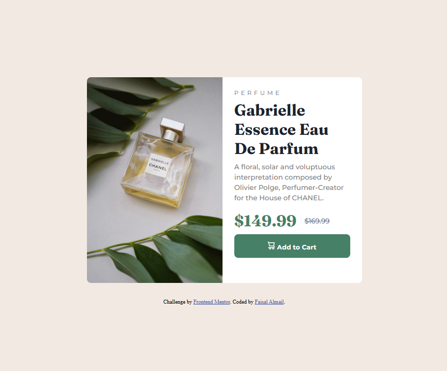

# Frontend Mentor - Product preview card component solution

This is a solution to the [Product preview card component challenge on Frontend Mentor](https://www.frontendmentor.io/challenges/product-preview-card-component-GO7UmttRfa). Frontend Mentor challenges help you improve your coding skills by building realistic projects. 

## Table of contents

- [Overview](#overview)
  - [The challenge](#the-challenge)
  - [Screenshot](#screenshot)
  - [Links](#links)
- [My process](#my-process)
  - [Built with](#built-with)
  - [What I learned](#what-i-learned)
  - [Continued development](#continued-development)
  - [Useful resources](#useful-resources)
- [Author](#author)

### The challenge

Users should be able to:

- View the optimal layout depending on their device's screen size
- See hover and focus states for interactive elements

### Screenshot

### Links

- Solution URL: [https://github.com/faisalalmail/product-preview-card](https://github.com/faisalalmail/product-preview-card)
- Live Site URL: [https://product-preview-card-six-zeta.vercel.app/](https://product-preview-card-six-zeta.vercel.app/)

## My process

### Built with

- Semantic HTML5 markup
- CSS custom properties
- Flexbox
- CSS Grid
- Mobile-first workflow

### What I learned

In the ideas section of the challenge, its suggested that the style is written using a pre-processor like Sass which I used in this project.

**honestly**, I wouldnt use it for a project of this size, and at this level of skill. 

**I learned** that there is much more to know about CSS before going to use a pre-processor.

I also learned that they are good to ease the process of managing your CSS if you have lots of code.

### Continued development

The main outcome of this challenge was to create a desponsive design, and its my first implementation of such thing. its a pretty simple one so I think the development will be working with more complex layouts with more elements.

### Useful resources

- [web.dev](https://web.dev/learn/design/media-queries?hl=en) - I learned more about media queries from this page.

## Author

My name is Faisal - A 35 year old guy from a small island in the middle of the world called Bahrain. I had the passion to code and practiced with html and PHP long ago. I stopped then, but the passion never died. and this could be my way to return.

- Instagram - [Faisal Almail](https://www.instagram.com/faisal.almail)
- Frontend Mentor - [@FaisalAlmail](https://www.frontendmentor.io/profile/faisalalmail)
